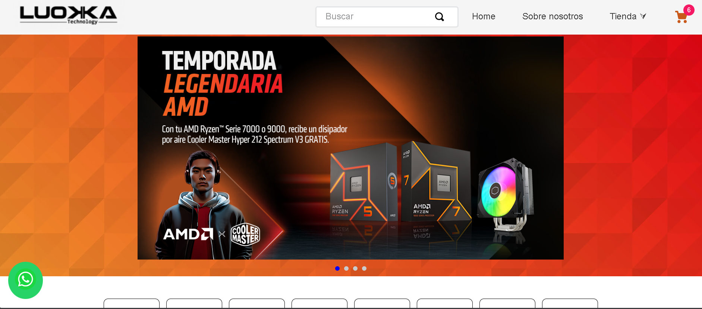

# 🟢 Componente Whatsapp Button

---

## 🚀 Visión General

Este componente de VTEX IO muestra un **botón flotante de WhatsApp** en la esquina inferior izquierda de la pantalla, permitiendo a los clientes iniciar una conversación con un mensaje predefinido.

## 🖼️ Previsualización del Componente



---

## 🏗️ Instalación y Uso

#### 1. Dependencia

Asegúrate de declarar la aplicación del componente en las dependencias de el `manifest.json` de tu tienda.

#### 2. Declaración en Blocks

El componente se declara y se configura como un block, generalmente en un *template* o bloque principal (Ej. `store/blocks.jsonc`).

```json
"store:custom#home": {
  "blocks": [
    "whatsapp-button"
    // Otros bloques...
  ]
},
"whatsapp-button": {
  "props": {
    "logo": "assets/img/whatsapp-logo.png",
    "phone": "573106187108",
    "message": "Hola, estaba en la tienda y quiero saber acerca de: ",
    "width": 40,    
    "height": 40
  }
}
```
## ⚙️ Propiedades (Props)

Estas propiedades permiten configurar el comportamiento y la apariencia del botón. 
La configuración utiliza el esquema (schema) definido en el componente.
| Propiedad | Tipo | Obligatorio | Valor por Defecto | Descripción |
| :--- | :--- | :--- | :--- | :--- |
| **`logo`** | String | Sí | `https://upload.wikimedia.org/commons/6/6b/WhatsApp.svg` | URL o path de la imagen del logo. Usa `image-uploader` en Site Editor. |
| **`phone`** | String | Sí | `573106187108` | Número de WhatsApp (con código de país, Ej: `573001234567`). |
| **`message`** | String | No | `Hola desde el componente...` | Mensaje de texto que se precarga al abrir el chat. |
| **`alt`** | String | No | `Imagen del logo de whatsapp` | Texto alternativo (`alt`) para la accesibilidad de la imagen. |
| **`width`** | String / Number | No | `40` | Ancho del logo en píxeles. |
| **`height`** | String / Number | No | `40` | Alto del logo en píxeles. |

## 🎨 Estilo y Posición

Posición Fija: El componente está codificado para ser fijo en la parte inferior izquierda (fixed bottom-1 left-1).

Color de Fondo: El fondo del contenedor es verde (#25d366).

URL Generada: La URL de destino utiliza la API de WhatsApp, concatenando el número y el mensaje:https://api.whatsapp.com/send?phone=${phone}&#038;text=${message}.
